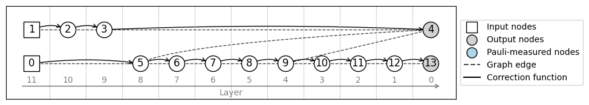

# graphix-mqtbench

This plugin provides an interface between [Graphix](https://github.com/TeamGraphix/graphix) and the [MQT Bench](https://mqt.readthedocs.io/projects/bench/en/latest/index.html) suite for benchmarking purposes.

## Installation

This package supports [`uv`](https://docs.astral.sh/uv/):

```bash
git clone https://github.com/TeamGraphix/graphix-mqtbench.git
cd graphix-mqtbench
uv sync
```

This creates a virtual environment and installs the necessary dependencies from the `pyproject.toml` and `uv` lockfile.

_Note_: This package depends on the [`graphix-qasm-parser`](https://github.com/TeamGraphix/graphix-qasm-parser) plugin to transpile qiskit circuits into Graphix circuits.

## Basic usage

The package provides a wrapper around MQT Bench quantum circuits. Given a benchmark name and a qubit count, the class `MQTBenchmark`  exposes a raw Qiskit circuit, and the corresponding Graphix circuit and pattern.

```python
from graphix_mqtbench import MQTBenchmark, BenchmarkName

bench = MQTBenchmark(name=BenchmarkName.QFT, nqubits=2)
pattern = bench.pattern
pattern.to_bloch().draw()
```



## Supported benchmarks

The definitions in `_benchmark_names.py` depend on the version of the `mqtbench` package. In particular, `mqtbench` 2.2.3 introduced the new benchmarks `dynamic_qft` and `iqpe` which contain feed-forward primitives that are still unrepresentable on Graphix circuits, so `test_benchmark_names` fails if `mqtbench` 2.2.3 is used with the current code. We currently pin `mqtbench` to version 2.2.2 and provide the script `_generate_benchmark_names.py`, which developers can run to regenerate `_benchmark_names.py`. Running

```bash
uv run python _generate_benchmark_names.py
```

regenerates `_benchmark_names.py`.


## Benchmarking Graphix

To run this notebook, install the package with extra dependencies:

```bash
uv sync --extra examples
```

### Benchmark characterization

As of version 0.3.5, Graphix supports two optimizations at the pattern level: _space minimization_ and _Pauli removal_.

- Space minimization rearranges the pattern commands in order to minimize the maximum number of qubits alive at any given time during the execution. This optimization is crucial to reduce the memory allocation in dense-state simulations. For patterns with causal flow (e.g., those directly transpiled from a quantum circuit), `Pattern.minimize_space` returns an optimal vale: `max_space = n_qubits + 1`.

- Pauli removal removes Pauli measurements on non-input qubits at the expense of adding local Clifford commands. This optimization can significantly reduce the number of commands (and, specially, measurement commands which are the bottleneck in dense-state simulations). However, it comes with a trade-off: patterns with causal flow are only guaranteed to have gflow after this optimization step. Performing space minimization on patterns without causal flow is known to be an NP-hard problem, and heuristics can fail to find a "good" measurement order.

As show in the table below, "Pauli removal + Space minimization" will often reduce the number of commands but `max_space` can become significantly larger than if only "Space minimization" is applied.


```python
from graphix_mqtbench import generate_benchmarks
import pandas as pd

nqubit = 4
benchmarks = generate_benchmarks(nqubit)

rows = []
for bench in benchmarks:
    p = bench.pattern
    p_space = p.minimize_space(copy=True)
    p_pauli = p.infer_pauli_measurements().remove_pauli_measurements(copy=True)
    p_pauli_space = p_pauli.minimize_space(copy=True)

    rows.append({
        ("Circuit", "Benchmark"): bench.name.value,
        ("Circuit", "Qubits"): bench.nqubits,
        ("Circuit", "Gates"): len(bench.circuit.instruction),
        ("Transpilation", "Max Space"): p.max_space(),
        ("Transpilation", "Cmds"): len(p),
        ("Space min.", "Max Space"): p_space.max_space(),
        ("Space min.", "Cmds"): len(p_space),
        ("Pauli removal", "Max Space"): p_pauli.max_space(),
        ("Pauli removal", "Cmds"): len(p_pauli),
        ("Pauli removal + Space min.", "Max Space"): p_pauli_space.max_space(),
        ("Pauli removal + Space min.", "Cmds"): len(p_pauli_space),
    })

df = pd.DataFrame(rows)
df.columns = pd.MultiIndex.from_tuples(df.columns)
df
```

<table border="1" class="dataframe">
  <thead>
    <tr>
      <th></th>
      <th colspan="3" halign="left">Circuit</th>
      <th colspan="2" halign="left">Transpilation</th>
      <th colspan="2" halign="left">Space min.</th>
      <th colspan="2" halign="left">Pauli removal</th>
      <th colspan="2" halign="left">Pauli removal + Space min.</th>
    </tr>
    <tr>
      <th></th>
      <th>Benchmark</th>
      <th>Qubits</th>
      <th>Gates</th>
      <th>Max Space</th>
      <th>Cmds</th>
      <th>Max Space</th>
      <th>Cmds</th>
      <th>Max Space</th>
      <th>Cmds</th>
      <th>Max Space</th>
      <th>Cmds</th>
    </tr>
  </thead>
  <tbody>
    <tr>
      <th>0</th>
      <td>ae</td>
      <td>4</td>
      <td>119</td>
      <td>5</td>
      <td>716</td>
      <td>5</td>
      <td>716</td>
      <td>23</td>
      <td>183</td>
      <td>10</td>
      <td>183</td>
    </tr>
    <tr>
      <th>1</th>
      <td>bmw_quark_cardinality</td>
      <td>4</td>
      <td>123</td>
      <td>5</td>
      <td>656</td>
      <td>5</td>
      <td>656</td>
      <td>12</td>
      <td>167</td>
      <td>10</td>
      <td>167</td>
    </tr>
    <tr>
      <th>2</th>
      <td>bmw_quark_copula</td>
      <td>4</td>
      <td>72</td>
      <td>5</td>
      <td>396</td>
      <td>5</td>
      <td>396</td>
      <td>12</td>
      <td>145</td>
      <td>12</td>
      <td>145</td>
    </tr>
    <tr>
      <th>3</th>
      <td>bv</td>
      <td>4</td>
      <td>4</td>
      <td>5</td>
      <td>17</td>
      <td>5</td>
      <td>17</td>
      <td>6</td>
      <td>11</td>
      <td>5</td>
      <td>11</td>
    </tr>
    <tr>
      <th>4</th>
      <td>cdkm_ripple_carry_adder</td>
      <td>4</td>
      <td>7</td>
      <td>5</td>
      <td>235</td>
      <td>5</td>
      <td>235</td>
      <td>20</td>
      <td>99</td>
      <td>20</td>
      <td>99</td>
    </tr>
    <tr>
      <th>5</th>
      <td>dj</td>
      <td>4</td>
      <td>16</td>
      <td>5</td>
      <td>89</td>
      <td>5</td>
      <td>89</td>
      <td>5</td>
      <td>23</td>
      <td>5</td>
      <td>23</td>
    </tr>
    <tr>
      <th>6</th>
      <td>draper_qft_adder</td>
      <td>4</td>
      <td>29</td>
      <td>5</td>
      <td>180</td>
      <td>5</td>
      <td>180</td>
      <td>13</td>
      <td>54</td>
      <td>9</td>
      <td>54</td>
    </tr>
    <tr>
      <th>7</th>
      <td>full_adder</td>
      <td>4</td>
      <td>6</td>
      <td>5</td>
      <td>228</td>
      <td>5</td>
      <td>228</td>
      <td>14</td>
      <td>74</td>
      <td>12</td>
      <td>74</td>
    </tr>
    <tr>
      <th>8</th>
      <td>ghz</td>
      <td>4</td>
      <td>4</td>
      <td>5</td>
      <td>32</td>
      <td>5</td>
      <td>32</td>
      <td>5</td>
      <td>28</td>
      <td>5</td>
      <td>28</td>
    </tr>
    <tr>
      <th>9</th>
      <td>graphstate</td>
      <td>4</td>
      <td>8</td>
      <td>5</td>
      <td>24</td>
      <td>5</td>
      <td>24</td>
      <td>5</td>
      <td>24</td>
      <td>5</td>
      <td>24</td>
    </tr>
    <tr>
      <th>10</th>
      <td>grover</td>
      <td>4</td>
      <td>132</td>
      <td>5</td>
      <td>939</td>
      <td>5</td>
      <td>939</td>
      <td>19</td>
      <td>309</td>
      <td>19</td>
      <td>309</td>
    </tr>
    <tr>
      <th>11</th>
      <td>hhl</td>
      <td>4</td>
      <td>49</td>
      <td>5</td>
      <td>306</td>
      <td>5</td>
      <td>306</td>
      <td>16</td>
      <td>94</td>
      <td>16</td>
      <td>94</td>
    </tr>
    <tr>
      <th>12</th>
      <td>modular_adder</td>
      <td>4</td>
      <td>31</td>
      <td>5</td>
      <td>180</td>
      <td>5</td>
      <td>180</td>
      <td>12</td>
      <td>57</td>
      <td>9</td>
      <td>57</td>
    </tr>
    <tr>
      <th>13</th>
      <td>multiplier</td>
      <td>4</td>
      <td>43</td>
      <td>5</td>
      <td>397</td>
      <td>5</td>
      <td>397</td>
      <td>22</td>
      <td>123</td>
      <td>8</td>
      <td>123</td>
    </tr>
    <tr>
      <th>14</th>
      <td>qaoa</td>
      <td>4</td>
      <td>24</td>
      <td>5</td>
      <td>151</td>
      <td>5</td>
      <td>151</td>
      <td>8</td>
      <td>66</td>
      <td>8</td>
      <td>66</td>
    </tr>
    <tr>
      <th>15</th>
      <td>qft</td>
      <td>4</td>
      <td>34</td>
      <td>5</td>
      <td>212</td>
      <td>5</td>
      <td>212</td>
      <td>17</td>
      <td>79</td>
      <td>11</td>
      <td>79</td>
    </tr>
    <tr>
      <th>16</th>
      <td>qftentangled</td>
      <td>4</td>
      <td>38</td>
      <td>5</td>
      <td>236</td>
      <td>5</td>
      <td>236</td>
      <td>13</td>
      <td>98</td>
      <td>9</td>
      <td>98</td>
    </tr>
    <tr>
      <th>17</th>
      <td>qnn</td>
      <td>4</td>
      <td>27</td>
      <td>5</td>
      <td>197</td>
      <td>5</td>
      <td>197</td>
      <td>6</td>
      <td>66</td>
      <td>5</td>
      <td>66</td>
    </tr>
    <tr>
      <th>18</th>
      <td>qpeexact</td>
      <td>4</td>
      <td>25</td>
      <td>5</td>
      <td>154</td>
      <td>5</td>
      <td>154</td>
      <td>9</td>
      <td>51</td>
      <td>9</td>
      <td>51</td>
    </tr>
    <tr>
      <th>19</th>
      <td>qpeinexact</td>
      <td>4</td>
      <td>37</td>
      <td>5</td>
      <td>224</td>
      <td>5</td>
      <td>224</td>
      <td>17</td>
      <td>90</td>
      <td>8</td>
      <td>90</td>
    </tr>
    <tr>
      <th>20</th>
      <td>qwalk</td>
      <td>4</td>
      <td>250</td>
      <td>5</td>
      <td>2135</td>
      <td>5</td>
      <td>2135</td>
      <td>117</td>
      <td>695</td>
      <td>109</td>
      <td>695</td>
    </tr>
    <tr>
      <th>21</th>
      <td>randomcircuit</td>
      <td>4</td>
      <td>108</td>
      <td>5</td>
      <td>968</td>
      <td>5</td>
      <td>968</td>
      <td>45</td>
      <td>299</td>
      <td>24</td>
      <td>299</td>
    </tr>
    <tr>
      <th>22</th>
      <td>rg_qft_multiplier</td>
      <td>4</td>
      <td>40</td>
      <td>5</td>
      <td>252</td>
      <td>5</td>
      <td>252</td>
      <td>15</td>
      <td>96</td>
      <td>13</td>
      <td>96</td>
    </tr>
    <tr>
      <th>23</th>
      <td>vbe_ripple_carry_adder</td>
      <td>4</td>
      <td>6</td>
      <td>5</td>
      <td>228</td>
      <td>5</td>
      <td>228</td>
      <td>14</td>
      <td>74</td>
      <td>12</td>
      <td>74</td>
    </tr>
    <tr>
      <th>24</th>
      <td>vqe_real_amp</td>
      <td>4</td>
      <td>25</td>
      <td>5</td>
      <td>263</td>
      <td>5</td>
      <td>263</td>
      <td>8</td>
      <td>112</td>
      <td>8</td>
      <td>112</td>
    </tr>
    <tr>
      <th>25</th>
      <td>vqe_su2</td>
      <td>4</td>
      <td>89</td>
      <td>5</td>
      <td>551</td>
      <td>5</td>
      <td>551</td>
      <td>11</td>
      <td>167</td>
      <td>8</td>
      <td>167</td>
    </tr>
    <tr>
      <th>26</th>
      <td>vqe_two_local</td>
      <td>4</td>
      <td>34</td>
      <td>5</td>
      <td>326</td>
      <td>5</td>
      <td>326</td>
      <td>10</td>
      <td>110</td>
      <td>8</td>
      <td>110</td>
    </tr>
    <tr>
      <th>27</th>
      <td>wstate</td>
      <td>4</td>
      <td>13</td>
      <td>5</td>
      <td>110</td>
      <td>5</td>
      <td>110</td>
      <td>10</td>
      <td>58</td>
      <td>7</td>
      <td>58</td>
    </tr>
  </tbody>
</table>
</div>


### Minimal backend benchmark


```python
import timeit
from graphix_mqtbench import MQTBenchmark, BenchmarkName
import numpy as np

rng = np.random.default_rng(42)

def simulate(pattern, backend):
    def run():
        return pattern.simulate_pattern(backend=backend, rng=rng)
    return run

benchmark = MQTBenchmark(name=BenchmarkName.QFT, nqubits=14)
pattern = benchmark.pattern.minimize_space()

run = simulate(pattern, backend="statevector")
timer = timeit.Timer(run)
t = min(timer.repeat(number=1, repeat=5))

print(
f"Benchmark = {benchmark.name.value}\n\
nqubits = {benchmark.nqubits}\n\
max_space = {pattern.max_space()}\n\
n_commands = {len(pattern)}\n\
simulation time = {t:.5f} s")
```

    Benchmark = qft
    nqubits = 14
    max_space = 15
    n_commands = 2982
    simulation time = 0.65946 s

## Acknowledgements

The function `graphix_mqtbench.converter.qiskit_to_graphix_circuit` was developped by @ACE07-Sev for the unitaryDESIGN 2025 edition.
